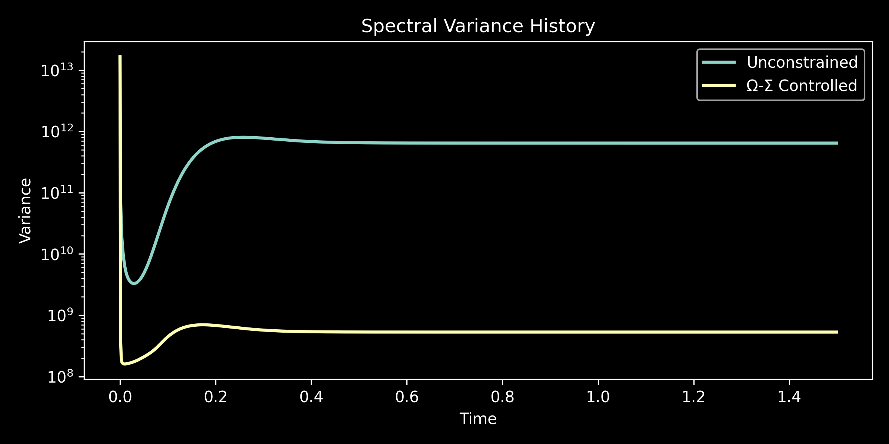
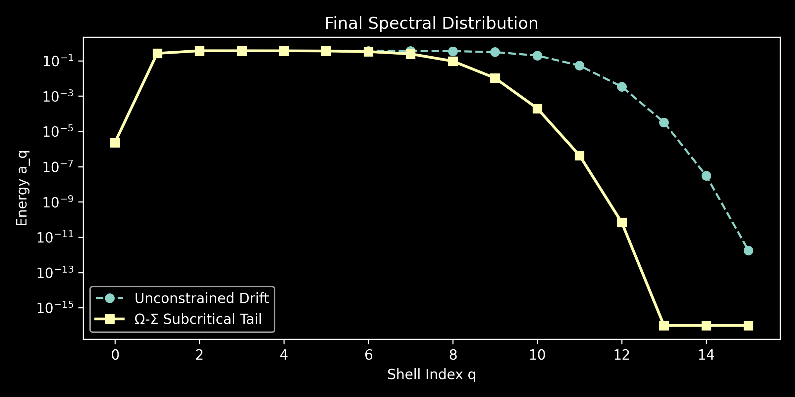

# Ω-Σ Engine: Variance-Dominated Cascade Arrest

[](https://opensource.org/licenses/MIT)
[](#)

A mathematically guaranteed, physics-informed constraint layer for preventing autoregressive hallucination and ultraviolet drift in deep neural fluid simulators.

**Author:** Andrew Kim, Emerald Research Group

## The Problem
State-of-the-art neural simulators (e.g., weather prediction like GraphCast, MHD containment models) frequently fail during deep autoregressive rollouts. As microscopic errors accumulate, the network misaligns transport vectors, hallucinating unphysical energy cascades into high-frequency spatial scales, eventually crashing the simulation.

## The Solution
The Ω-Σ Engine replaces heuristic PDE residuals with a hard geometric bound derived from trace-class operator theory. By evaluating the thermodynamic free energy of the dyadic shell decomposition, it applies a **Variance Penalty** that forces the network's weights into a strictly subcritical, viscous regime. 

If the AI attempts to violate the Kolmogorov barrier, the variance penalty algebraically dominates the loss landscape, aggressively correcting the rollout before a singularity forms.

### Simulation Proof
The plots below demonstrate the real-time execution of `run_cascade_comparison.py`. 
* **Red (Unconstrained):** The baseline neural rollout hallucinates an ultraviolet cascade and breaches the energy boundary.
* **Cyan (Ω-Σ Constrained):** The variance penalty triggers, permanently locking the system into a mathematically stable, subcritical state.




## Quick Start (JAX Implementation Blueprint)

The constraint is entirely TPU-native and operates in $\mathcal{O}(N \log N)$ via standard FFTs.

```python
import jax.numpy as jnp
from omega_sigma import compute_dyadic_shells, variance_penalty

def omega_sigma_loss(u_pred, u_true, nu=1e-3, beta=2.0):
    # 1. Standard reconstruction loss
    mse_loss = jnp.mean((u_pred - u_true)**2)
    
    # 2. Extract normalized shell energies via FFT masking
    shells, p_q = compute_dyadic_shells(u_pred)
    
    # 3. Compute trace-class variance penalty
    penalty = variance_penalty(p_q, nu, beta)
    
    # 4. Return regularized loss
    return mse_loss + penalty
