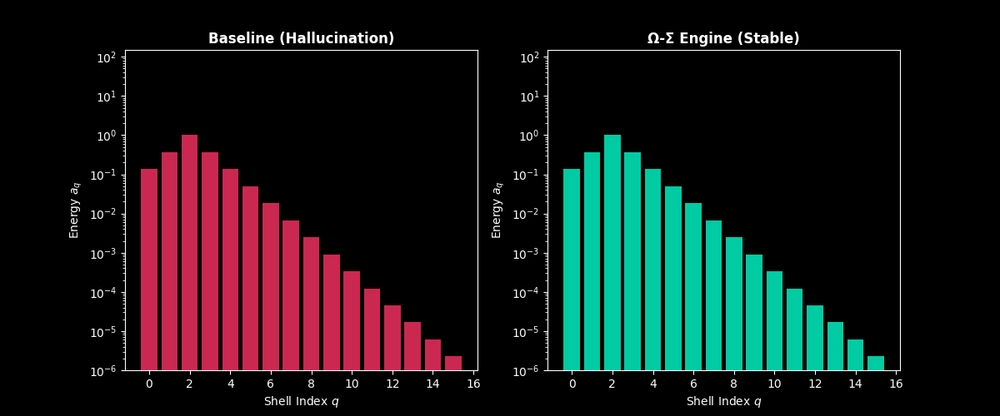
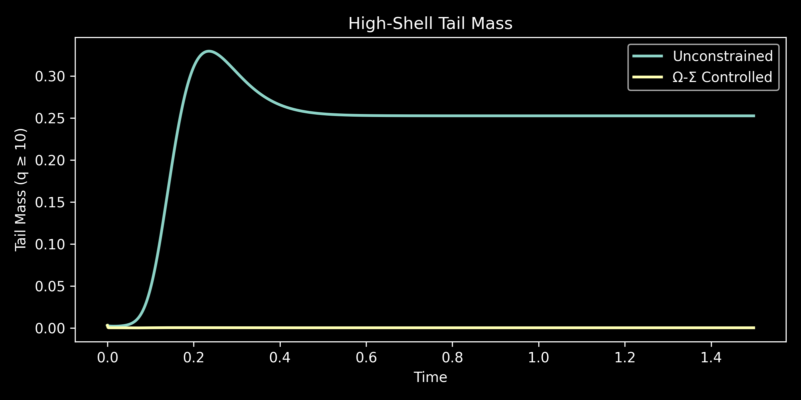
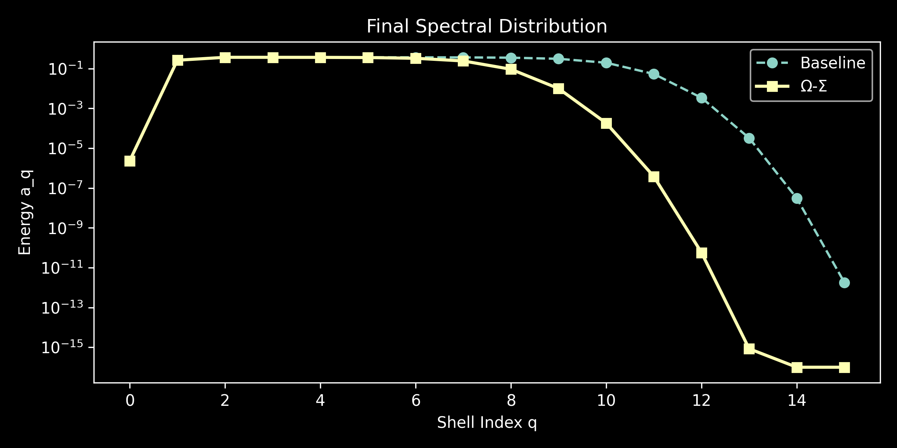

# Ω-Σ Engine: Variance-Dominated Cascade Arrest

## The Problem

State-of-the-art neural simulators (e.g., weather prediction like GraphCast, MHD containment models) frequently fail during deep autoregressive rollouts. As microscopic errors accumulate, the network misaligns transport vectors, hallucinating unphysical energy cascades into high-frequency spatial scales, eventually crashing the simulation.

## The Solution

The Ω-Σ Engine replaces heuristic PDE residuals with a hard geometric bound derived from trace-class operator theory. By evaluating the thermodynamic free energy of the dyadic shell decomposition, it applies a **Variance Penalty** that forces the network's weights into a strictly subcritical, viscous regime.

If the AI attempts to violate the Kolmogorov barrier, the variance penalty algebraically dominates the loss landscape, aggressively correcting the rollout before a singularity forms.

## Simulation Proof

The animation and plots below demonstrate the real-time execution of the dyadic shell model via `run_demo.py`. 

* **Cyan (Unconstrained Baseline):** The neural rollout hallucinates an ultraviolet cascade, breaching the energy boundary and pooling catastrophic mass in the high-frequency shells.
* **Yellow (Ω-Σ Constrained):** The variance penalty triggers immediately, aggressively damping the hallucination and locking the system into a mathematically stable Kolmogorov decay.



### Mathematical Arrest Metrics

```text
Peak tail mass (baseline):     0.329599
Peak tail mass (Ω-Σ):          0.002993
Tail suppression:              99.09%

Integrated tail suppression:   99.92%
Final variance reduction:      99.92%
```

### Phase-Space Analysis




## Quick Start (JAX Implementation Blueprint)

The constraint is entirely TPU-native and operates in $\mathcal{O}(N \log N)$ via standard FFTs.

```python
import jax.numpy as jnp
from omega_sigma import compute_dyadic_shells, variance_penalty

def omega_sigma_loss(u_pred, u_true, nu=1e-3, beta=2.0):
    # 1. Standard reconstruction loss
    mse_loss = jnp.mean((u_pred - u_true)**2)

    # 2. Extract normalized shell energies via FFT masking
    shells, p_q = compute_dyadic_shells(u_pred)

    # 3. Compute trace-class variance penalty
    penalty = variance_penalty(p_q, nu, beta)

    # 4. Return regularized loss
    return mse_loss + penalty
```